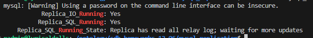
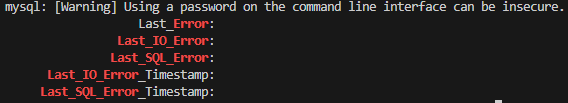
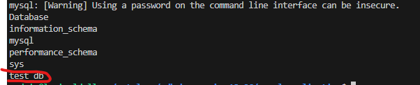
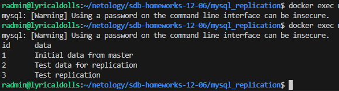

# sdb-homeworks-12-06

## Задание 1
На лекции рассматривались режимы репликации master-slave, master-master, опишите их различия.

Ответить в свободной форме.

## Ответ на задание 1
Master-Slave
Принцип работы: 
Существует один главный сервер (master), на который выполняются все операции записи и изменения данных. Один или несколько серверов (slave) получают копию данных с master и поддерживают их в актуальном состоянии, репликация однонаправленная — от master к slave.

- Разгрузка master за счёт выполнения чтения на slave.
- Резервирование данных (бэкапы).
- Запись всегда только на master.
- При его сбое требуется ручное переключение или настройка автоматического failover.

Master-Master
Принцип работы:
Несколько серверов работают в роли master. Каждый из них может принимать и запись, и чтение,
двунапраленое изменение, сделанные на одном master, передаются на другой master.

- Балансировка нагрузки при большом числе операций записи.
- Высокая доступность: при падении одного master другой продолжает полноценно работать.
- Возможны конфликты при одновременной записи одинаковых данных на разных master (например, изменения одной и той же строки).
- Настройка и сопровождение сложнее.

Вывод:
Master-Slave проще в конфигурации и надёжен для сценариев много чтения — мало записи.
Master-Master даёт отказоустойчивость и распределение нагрузки на запись, но требует более дорогого админа.

## Задание 2
Выполните конфигурацию master-slave репликации, примером можно пользоваться из лекции.

Приложите скриншоты конфигурации, выполнения работы: состояния и режимы работы серверов.

## Ответ на задание 2

[Структура](https://github.com/RomanDiskTop/sdb-homeworks-12-06/tree/main/mysql_replication)

## Проверка master!

### Проверка пользователя репликации
```
docker exec mysql_master mysql -uroot -p"НАШ_PASS" -e "SELECT user, host, plugin FROM mysql.user WHERE user='repl';"
```
### Проверка тестовой базы
```
docker exec mysql_master mysql -uroot -p"НАШ_PASS" -e "SHOW DATABASES; USE test_db; SHOW TABLES; SELECT * FROM example;"
```
### Получение статуса Master
```
docker exec mysql_master mysql -uroot -p"НАШ_PASS" -e "SHOW MASTER STATUS\G"
```

## Настройка slave!

### Проверка готовности Slave

```
docker exec mysql_slave mysql -uroot -p"НАШ_PASS" -e "SELECT 'Slave ready' as status;"
```

### Настройка репликации

```
docker exec mysql_slave mysql -uroot -p"НАШ_PASS" -e "
CHANGE REPLICATION SOURCE TO
SOURCE_HOST='mysql_master',
SOURCE_USER='repl', 
SOURCE_PASSWORD='НАШ_PASS',
SOURCE_LOG_FILE='mysql-bin.000003',
SOURCE_LOG_POS=157;
START REPLICA;"
```

### Проверка реплики

```
docker exec mysql_slave mysql -uroot -p"НАШ_PASS" -e "SHOW REPLICA STATUS\G" | grep Running
```



### Ошибочкии

```
docker exec mysql_slave mysql -uroot -p"НАШ_PASS" -e "SHOW REPLICA STATUS\G" | grep -E "(Last_IO_Error|Last_SQL_Error|Error)"
```


### Проверка базы на slave

```
docker exec mysql_slave mysql -uroot -p"НАШ_PASS" -e "SHOW DATABASES;"
```


### Добавление тестовых данных на master

```
docker exec mysql_master mysql -uroot -p"НАШ_PASS" -e "USE test_db; INSERT INTO example (data) VALUES ('Test replication');"
```

### Проверка данных на Slave

```
docker exec mysql_slave mysql -uroot -p"НАШ_PASS" -e "USE test_db; SELECT * FROM example;"
```
